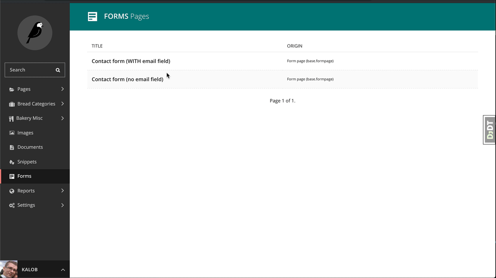

# Wagtail Contact Reply

> Reply to contact form submissions directly from the Wagtail admin



### Installation

```
pip install wagtail-contact-reply
```

```python
INSTALLED_APPS = [
    # ....
    'wagtail_contact_reply',  # Must be before wagtail.contrib.forms
    'wagtail.contrib.forms',
    # ...
]
```

### Contributing
I'm always open to PR's to improve this code and I'm not too picky about how it gets done. If you can make a contribution, I invite you to open a pull request (or an issue).

### Todos
Things I want to do with this package but may or may not get the time to do...

- [ ] Save replies to each contact submission
- [ ] View replies from each contact submission
- [ ] Allow BCC emails
- [ ] Optionally email all other admins
- [ ] Add a hook after the reply email is sent
- [ ] Create default settings to fallback on
- [ ] Add JavaScript form validation (ie. If the form is trying to be submitted but is missing a required field, show an alert box above the button)
- [ ] A few standard tests for at least _some_ coverage

### Contibutors
- [x] Kalob Taulien
- [ ] _Your name soon?_
